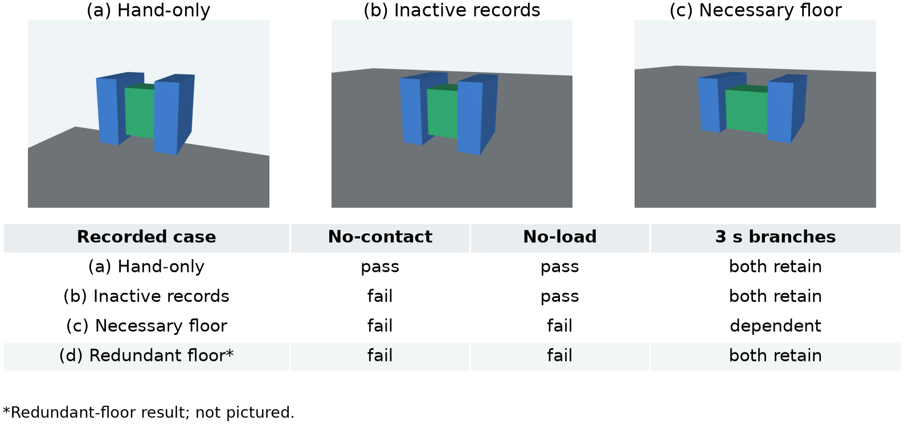
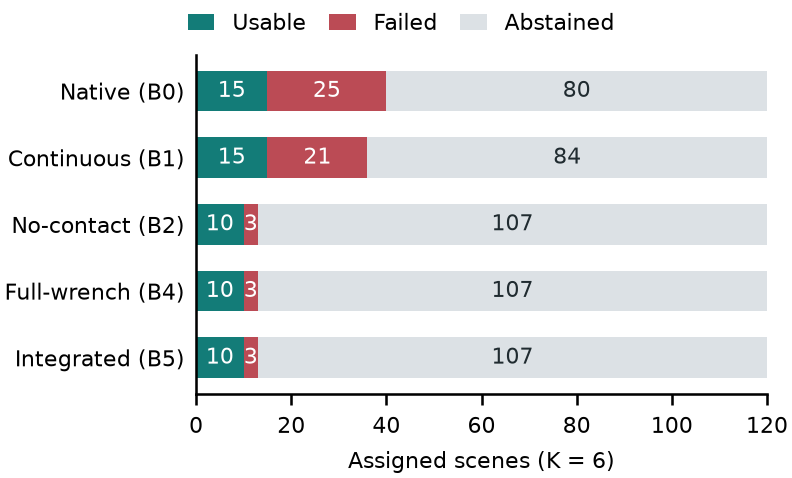
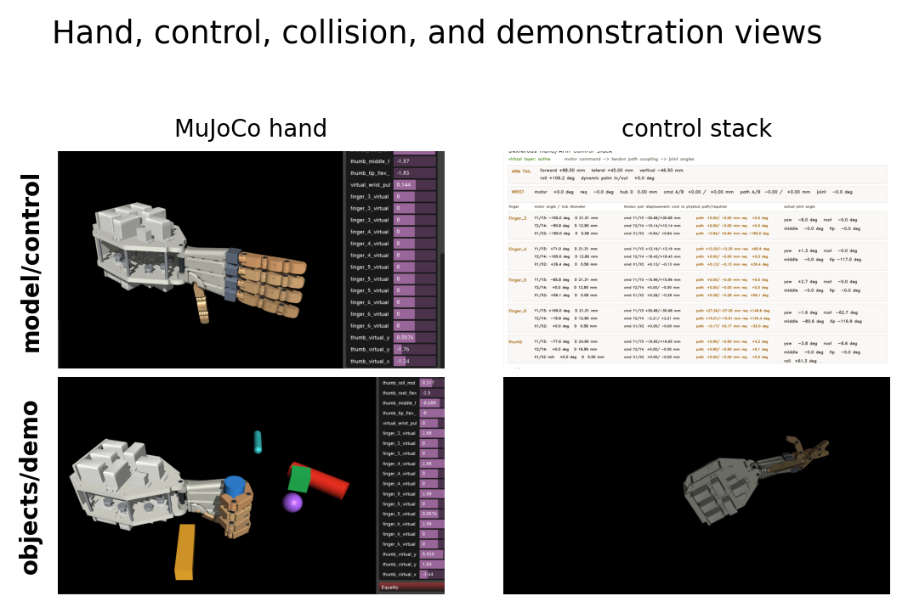
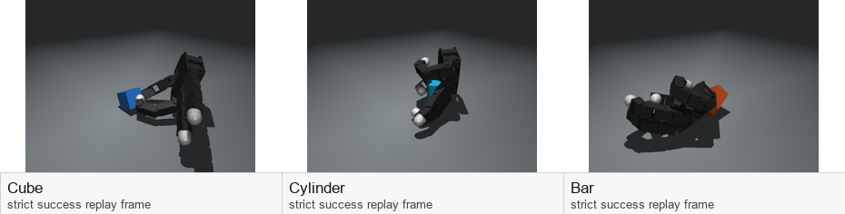

# When Grasp Metrics Disagree

### Contact, Load, and Retention in Simulation

**Teo Ee Hern · Tianjin University · Research artifact, V4.5**

[Main paper](paper/main.pdf) | [Supplement](paper/supplement.pdf) | [LaTeX source](paper/latex_source.zip) | [Versioned downloads](https://github.com/HenryTeo27/Grasp-Metrics-Disagree-Artifacts/releases/tag/v4.5)

Grasp contact, mechanical load support, and later task retention measure different
things. This MuJoCo study makes those distinctions explicit, tests them on
controlled physical cases and natural-task records, and reports where a richer
monitor **does not improve** on simpler alternatives.



## What This Project Contributes

- A traceable contact/load/retention evaluation pipeline with frozen protocols,
  mechanical baselines, claim-to-evidence records, and integrity checks.
- A 240-case controlled matrix plus eight representation partners; 120 fresh
  Allegro scenes with 720 candidates; 100 Fetch and 100 Shadow records.
- An offline reproduction package that recomputes reported aggregate statistics,
  selection outcomes and figures without a simulator or network connection.
- Explicit negative results and abstention accounting, including the difference
  between conditional success and usability across all scenes.

## Main Findings

| Comparison | Observed result | Interpretation |
| --- | --- | --- |
| Controlled no-load positives | Literal no-contact rejects 56 of 77 | Contact is not the same measurement as environmental load support. |
| Controlled nominal labels | Clearance, normal-only, full-wrench and integrated methods all match labels | No unique integrated-monitor advantage on this matrix. |
| Allegro K6 selection | B2/B4/B5: 10 usable, 3 failed returns, 107 abstentions out of 120 | Same choices; no demonstrated B5 improvement over B4. |
| Native Allegro selection | 15 usable, 25 failed returns, 80 abstentions out of 120 | A higher conditional rate need not yield more usable scenes. |
| Historical-exclusion retrospective | 0 of 85 scenes rescued | Only 177 of 510 slots have full load replays; 333 fail common conditions. |

Both registered primary B5-minus-B4 differences are zero. This is **not a
population-equivalence claim**, a solved dexterous-grasping result, or a hardware
validation. See the [supplement](paper/supplement.pdf) for definitions and denominators.



## Reproduce The Evidence

Use Python 3.11. The dependency versions below match the release verification
environment. Installing dependencies is a separate, potentially online step.

```bash
git clone https://github.com/HenryTeo27/Grasp-Metrics-Disagree-Artifacts.git
cd Grasp-Metrics-Disagree-Artifacts
python -m pip install -r requirements.txt
python -B scripts/verify_integrity.py
cd evidence
python -B reproduce_v4/reproduce.py --out ../recomputed
```

`recomputed` must not already exist. The verifier checks the frozen package
before and after execution, blocks simulator imports and network access,
recomputes tables and paired intervals, checks sealed selections and the claim
ledger, and rescores three packaged raw control examples. It regenerates the
original V4 scientific figures. It does **not** rerun experiments or independently
relabel the complete raw matrix. The V4.5 paper is an editorial consolidation of
those existing results, not another experiment.

For the optional V4.5 presentation figures, use a disposable copy of `evidence`
and run `python -B scripts/v45_editorial.py figures` there *after* verification.
That command writes inside its working package and changes its manifest state.

## Repository Guide

| Path | Contents |
| --- | --- |
| `paper/` | Five-page main paper, eleven-page supplement, buildable source ZIP |
| `figures/` | Paper figures and clearly labeled historical hand-system images |
| `evidence/reproduce_v4/` | Offline verifier and recomputation entry point |
| `evidence/scripts/v4/` | Scientific scoring, baselines, statistics and adapters |
| `evidence/evidence/research_v4/` | Frozen protocols, records, labels and reports |
| `evidence/tests/v4/` | Scientific regression tests; some require optional simulation dependencies |
| `evidence/notes/v4/claim_evidence_ledger.csv` | Claim-to-evidence mapping |
| `evidence/MANIFEST.sha256` | Original frozen evidence manifest |
| `release/` | Original distribution checksums |

The nested `evidence/evidence/` path preserves the original package byte for byte.
Historical diagnostics inside it include original workstation paths and earlier
release-status notes. They are provenance, not portable setup instructions.
This README describes the public distribution; old statements that hosting had
not yet occurred describe the earlier local release.

## Raw Data And Reproduction Limits

The [v4.5 release](https://github.com/HenryTeo27/Grasp-Metrics-Disagree-Artifacts/releases/tag/v4.5)
includes the unchanged label-evidence ZIP, source ZIP, manuscripts, checksums,
and a separate **1.56 GB controlled-raw companion** with 248 original NPZ traces
(240 final controls and eight representation partners). The raw companion is
optional and is not needed for aggregate reproduction.

Most natural-task, retrospective and calibration raw traces are **not included**.
Their hash/size inventory is not equivalent to public raw-data access. Inventory
`included` flags describe the label package, not the separate raw companion.
Complete raw-matrix adjudication and clean-machine dynamic reproduction are not
claimed. Third-party robot meshes, datasets, model checkpoints and installed
dependency trees are excluded. See [dependencies and rights](evidence/dependencies.md).

## Research Lineage: The Hands Still Matter

This study grew from a custom tendon-driven hand and an open-source Allegro
grasping program. Those systems are historical context, **not** the primitive
apparatus in the V4 controlled matrix, and their evidence is not pooled with V4.

| Custom hand simulation and control | Open-source hand research |
| --- | --- |
|  |  |

The [original engineering repository](https://github.com/HenryTeo27/Dexterous-Hand-Control-Sim)
contains the custom hand's design and control lineage. The current supplement
retains the separate V3 comparison of 37/360 versus 48/360, with all 11 gains
in spheres; it is not a new V4 result or a general robustness claim.

## Citation And Rights

This repository accompanies a research manuscript; no conference acceptance,
submission, or independent artifact certification is implied.
Use [CITATION.cff](CITATION.cff) when citing this version.

Original source code is available under the [MIT License](LICENSE), so it can be
used and modified in other projects. Papers, data and third-party resources have
separate rights; see [RIGHTS.md](RIGHTS.md). Please use GitHub issues for reproducibility questions
and report the failing command, Python/package versions and relevant output.
